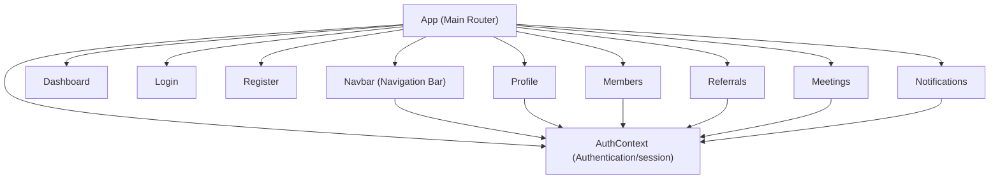
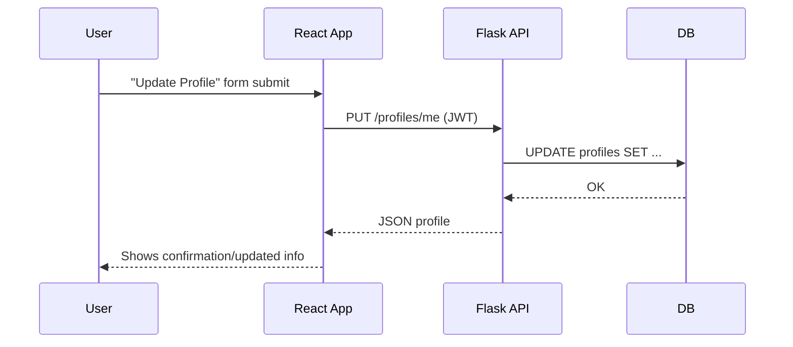

# ProNet Connect Design Documentation

## UI/UX Overview

- **Modern, minimal style**: Flat design, clean CSS variables for theme/day-night.
- **Layout**: Top navigation bar, dashboard center panel, responsive modal/forms.
- **Navigation**: Route-based (React Router). Access to dashboard, members, referrals, meetings, notifications, profile.
- **Color Palette**:
  - Primary: #1867c0
  - Secondary: #f8bb44
  - Accent: #26a69a
  - Theme toggles: light/dark

---

## Main Frontend Components

---

## Key Flows

### Authentication

1. User registers/logins (Login.js/Register.js)
2. AuthContext manages localStorage token and user session.
3. ProtectedRoute wrappers redirect to login if unauthenticated.

### Dashboard

- **Dashboard.js**: Welcome banner and quick navigation links to all key areas.

### Members

- **Members.js**: Fetches list of members via `/members` API.
- Allows sending connection requests.

### Connections

- Integrated in Members.js via Connect button.
- Managed via `/connections` endpoints.

### Referrals

- **Referrals.js**:
    - Form to send referrals to other members
    - Tabs for sent & received, both loaded via APIs.

### Meetings

- **Meetings.js**:
    - List meetings for user.
    - Form to schedule new meeting (select member, choose time).

### Notifications

- **Notifications.js**:
    - Loads all user notifications.
    - Shows as list; marks as read upon view/interaction.

### Profile

- **Profile.js**:
    - View and update personal information.
    - Pulls user info from backend; PATCH/PUT to update.

---

## Backend API Design (Endpoints)

**All write endpoints require JWT Authentication. Common patterns:**

- `/auth/register`, `/auth/login`
- `/profiles/`, `/profiles/me` (GET, POST, PUT)
- `/connections/` (GET, POST), `/connections/{id}` (GET, PATCH)
- `/referrals/` (GET, POST), `/referrals/{id}` (GET, PATCH)
- `/meetings/` (GET, POST), `/meetings/{id}` (GET, PUT, DELETE)
- `/notifications/` (GET, POST), `/notifications/{id}/read` (POST)

---

## Database-to-Frontend Data Flow Example

---

## Error Handling and Validation

- Frontend forms enforce required field validation and show error/success feedback.
- Backend validates inputs via Marshmallow schemas.
- All endpoints return proper error codes/messages for failed auth, bad data, or permissions.

---

## Test Coverage

- React: Jest-based tests in `/src/__tests__`
- Backend: Pytest-based tests for endpoints and business flows (`backend/tests`)

---

For more on backend and API, see [ARCHITECTURE.md](../pronet-connect-127616-127627/ARCHITECTURE.md). For requirements, see [PRD.md](../pronet-connect-127616-127626/PRD.md).
